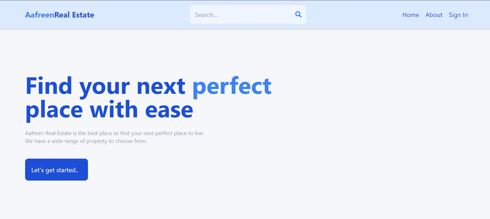
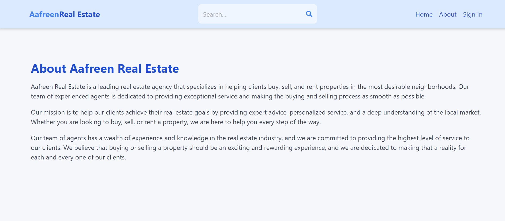
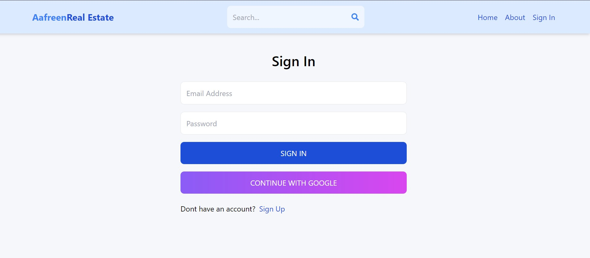

# Aafreen Real Estate - Real Estate Web App

Aafreen Real Estate is a modern real estate web application built with the MERN (MongoDB, Express.js, React, Node.js) stack. It provides a platform for users to search, list, and explore various properties, whether for sale or rent. The application offers a user-friendly interface, advanced search options, and a seamless user experience.

Check out the live app: [Aafreen Real Estate on Render](https://aafreen-realestate-tmt9.onrender.com/)

## Features

- **Property Listings**: View a wide range of property listings with detailed information, including descriptions, prices, addresses, and more.

- **Advanced Search**: Customize your property search by type (rent/sale), amenities, sorting options, and more.

- **User Profiles**: Registered users can create and manage their profiles with profile pictures and listings also.

- **Authentication**: Secure user registration and login functionality with Google OAuth.

## Screenshot

## Usage

- Access the web app via the provided link: [Aafreen Real Estate on Render](https://aafreen-realestate-tmt9.onrender.com/)

- Explore property listings, customize your search, and create a user profile to list properties or access additional features.

